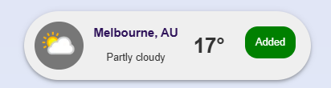
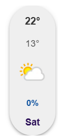
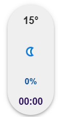
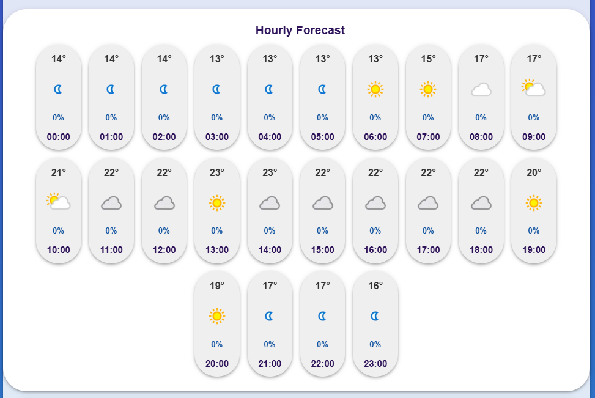
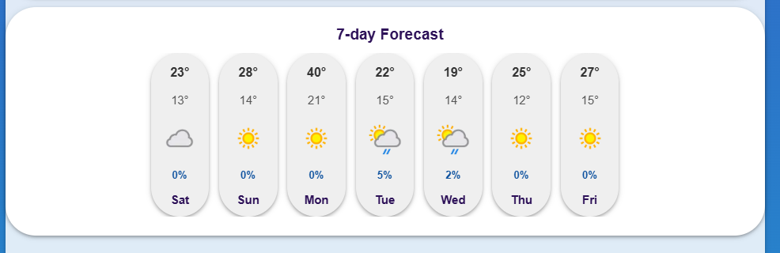

# WeatherWise

WeatherWise is a modern weather application that provides real-time weather updates, and forecasts.

## Team Members

- Danilo [GitHub](https://github.com/danilo90lan)
- Ethan [GitHub](https://github.com/finneh4249)
- Joel [GitHub](https://github.com/jevontrei)
- Peter [GitHub](https://github.com/peter-duongGHub)

## Features

- **Current Conditions**: Displays current temperature, humidity, wind speed, and weather conditions with intuitive icons.
- **Hourly Forecast**: Hour-by-hour forecast for the current day to help plan your day.
- **Daily Forecast**: 7-day forecast with high and low temperatures, precipitation chances, and condition icons.
- **Location Search**: Search and save your favorite locations for quick access.
- **Local Storage**: Saves cities locally without the need for a database.
- **Default Behavior**:
  - Auto-detects location based on IP or precise location with permission.

## Cards

- **Glance Cards**:
  - Weather icon
  - Location name and country
  - Weather condition (e.g., Partly Cloudy, Clear)
  - Temperature (Celsius)

## Details

- **Detailed Weather Information**:
  - Location name
  - Weather condition with icon
  - Temperature
  - Feels like temperature
  - High & low temperatures
  - Hourly and future forecasts
  - Precipitation chance
  - Wind speed
  - Sunrise & sunset times
  - UV Index
  - Humidity & dew point
  - Pressure (inHg)

## Installation

1. Clone the repository:

   ```bash
   git clone https://github.com/yourusername/weatherwise.git

## Components

### City Card



- Displays glanceable weather information for a city

Includes:

- Weather icon
- Location name and country
- Weather condition (e.g., Partly Cloudy)
- Temperature (Celsius)

### Day Card



- Showcases the daily forecast

Includes:

- High and Low temperatures
- Precipitation chances
- Condition icons

### Hour Card



- Showcases the current conditions or a forecast for a specific hour

Includes:

- Current or high temperature
- Precipitation chances
- Condition icons


### Hourly Forecast


- A list of Hour Cards for the current day


### Seven Day Forecast



- A list of Day Cards for today and the next 6 days

## Pages

### Home

- Displays the search bar and closest city.
- Displays current weather conditions using a City Card.
- Displays search results as City Cards.

### Details

- Provides comprehensive weather information for a selected location.

Includes:

- Location name
- Weather condition with icon
- Temperature
- Feels like temperature
- High & low temperatures
- Hourly and future forecasts
- Precipitation chance
- Wind speed
- Sunrise & sunset times
- UV Index
- Humidity & dew point
- Pressure (inHg)


### Saved Cities

- Allows users to view and manage their saved locations.
- Users can then navigate to the details page for any saved location.
